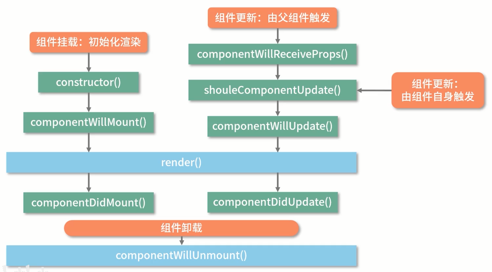
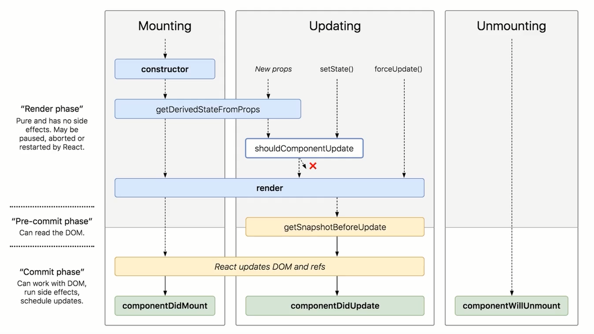

## React 生命周期

组件初始化 -> 通过 render() 方法，将 jsx 转为虚拟 DOM，ReactDOM.render() 转为真实 DOM

## React 15


1. mount 阶段 执行顺序
```js
// mount 阶段 执行顺序
parent render()
constructor()
componentWillMount()
child render()
componentDidMount()
```

2. update 阶段 执行顺序
```js
// 由父组件触发更新 顺序
parent render()
componentWillReceiveProps(nextProps)    // 相较于 子组件自身更新，多了一个生命周期，
shouldComponentUpdate(nextProps, nextState)
componentWillUpdate()
child render()
componentDidUpdate()
```
```js
// 由子组件触发更新 顺序
shouldComponentUpdate(nextProps, nextState)
componentWillUpdate()     // 更新前触发，可用于不涉及真实 DOM 操作的准备工作
child render()
componentDidUpdate()      // 可以 DOM
```

3. unmount 阶段
```js
parent render()
componentWillUnmount()
```

### componentWillReceiveProps(nextProps)
- 如果父组件导致组件重新渲染，即使 props 没有更改，也会调用此方法
- 如果只想处理更改，请确保进行当前值与变更值的比较

所以：
`componentWillReceiveProps` 不是由 props 的变化出发，而是由父组件的更新触发

### shouldComponentUpdate(nextProps, nextState)
- 渲染优化，避免不必要的 render
- 根据返回值决定是否执行后面的生命周期(默认 true)
- 进而决定是否 re-render

### componentWillUnmount
1. 组件在父组件中被移除了
2. 组件设置了 key，父组件在 rende 过程中，发现 key 与上一次不一致

## React 16.3
1. 废弃了 `componentWillMount`，新增 `getDerivedStateFromProps`
```js
parent render
constructor
getDerivedStateFromProps()    // 16.3 只有父组件更新触发   || 16.4+ 任何因素触发的组件更新流程都会触发 该方法
child render
componentDidMount
```
注意：`getDerivedStateFromProps` 不是 `componentWillMount` 的替代品，`componentWillMount` 的存在危险，应该被废弃

2. `getDerivedStateFromProps` 代替原 `componentWillReceiveProps(nextProps)`

3. 废弃 `componentWillUpdate` 新增 `getSnapshotBeforeUpdate`


### static getDerivedStateFromProps(props, state)
**用途：使用 props 来派生/更新 state**

1. 在`更新`和`挂载`阶段都会执行
2. `静态方法`，不依赖与组件实例而存在，`无法在方法内部访问 this`
3. 需要一个对象格式的返回值，
4. 对 state 的更新并非覆盖，只针对该属性进行更新
```js
static getDerivedStateFromProps (props, state) {
  return {
    parentText: props.text
  }
}
```
```js
this.state = { text: 'old-text' }
// 更新后的 state 
{
  text: 'old-text',
  parentText: 'some thing else'
}
```

5. 用于代替 `componentWillReceiveProps` API，但不完全等同于 `componentWillReceiveProps(nextProps)`
在挂载阶段可以代替，用于 基于 props 派生 state，并且只能做这一件事


## getSnapshotBeforeUpdate(prevProps, prevState)
```js
// 更新执行顺序
parent render
getDerivedStateFromProps()
shouldComponentUpdate()
child render
getSnapshotBeforeUpdate() { return 'haha' }
componentDidUpdate() // 从 getSnapshotBeforeUpdate 获取到的值是：haha
```
- `getSnapshotBeforeUpdate` 的返回值会作为第三个参数给到 `componentDidUpdate(nextProps, nextState, valueFromSnapshot)`
- 执行时机是在 render 方法之后，真实 DOM 更新之前
- 同时获取到 `更新前的真实 DOM` 和 更新前后的 `state&props`

使用场景：一个内容会变化的滚动列表，根据滚动列表的内容来决定是否记录滚动条的当前位置


## Fiber 下的生命周期
Fiber 是 React16 对 核心算法的一次重写，Fiber 能够使原本同步的渲染过程变成异步的

> React16 之前的版本，每触发一次组件更新，react 都要构建一颗新的 虚拟 DOM 树    
通过与上一次的 虚拟DOM 树进行对比，实现对 DOM 的定向更新
这是一个递归的过程;    
同步渲染的递归调用栈是非常深的，只有最底层的调用返回了，才会开始逐层返回，并且不可打断;    
一旦开始渲染，便会占据主线程，阻塞其他任务;    
所以同步渲染如果耗时过长，则面临卡顿甚至卡死;

Fiber 将会把一个大的更新任务拆解为多个小任务；    
每执行完一个小任务，渲染线程将会把主线程交还浏览器，查看是否有更高优先级的任务处理    
这样能够避免阻塞，减少卡顿    
把同步任务变为`可拆解、可打断`，这就是 `异步渲染`   

> 根据能否被 “打断” react16 生命周期被分为 `render` 和 `commit(pre-commit + commit)` 两个阶段

如图所示：


1. render 阶段：
    - 包括 constructor | getDerivedStateFromProps | shouldComponentUpdate | render
    - 纯净并且没有副作用，可能会`被打断、终止或者重新执行`

2. pre-commit 阶段：
    - getSnapshopBeforeUpdate
    - 可以读取 DOM

3. commit 阶段：
    - update阶段 | componentDidMount | componentDidUpdate | componentWillUnmount
    - 可以使用 DOM，执行副作用，调度更新


render 阶段可以被打断（用户不可见），commit 阶段总是同步执行（需要更改视图）

> 执行到一半*被打断*，之后是 `重复执行一遍整个任务`，而非接着执行中断后的任务

所以 render 阶段的生命周期有可能会被重复执行：
  - componentWillMount
  - componentWillUpdate
  - componentWillReceiveProps

在这些生命周期中，容易出现一些滥用操作：
  - setState 重复设置导致的死循环
  - fetch 异步请求
  - 真实 DOM 操作

Fiber 机制下，很可能导致重复操作（打断、重启），重复付款、删除等
