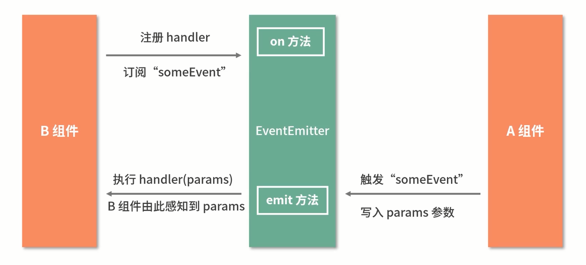

## React 当中的数据流

### 基于 props 的单向数据流
> 单向数据流指：当前组件的 state | props 只能流向组件树中`比自己更低级的组件`

对于处理简单 `父 <---> 子 | 子 <---> 父 | 子a <---> 父 <---> 子b` 三种数据传递

问题：      
层层传递简单，但对于嵌套过深的传递，容易代码浪费、繁琐、对于传递过程当中的组件数据造成污染

### 发布订阅模式


### Context API
- `const AppContext = React.createContext(defaultValue)` 
- Provider 数据提供
```js
<Provider value={ title: this.state.title }>
  <Title />
  <Main />
  <Footer />
</Provider>
```
- Consumer 接收数据，并且感知数据的更新并同步
```js
<Consumer>
{ value => <div>{ value.title }</div> }
</Consumer>
```

### Redux
> Redux 是 JavaScript 状态容器，提供可预测的状态管理，Redux 的数据流向是 **严格单向** 的

- store: 单一数据源，只读
    ```js
    import { createStore } from 'redux'
    const store = createStore({
      reducer
    })
    ```
- action: 对变化的描述
    ```js
    const action = {
      type: 'ADD_ITEM',
      payload: '<li>text</li>'
    }
    ```
- reducer: 对数据变化进行分发和处理
    > 作用：将新的 state 返回给 store   
    > **一个 reducer 一定是一个 纯函数**
    ```js
    const reducer = (state, action) => {
      return newState
    }
    ```

> 对于 React 应用来说，所有数据都来自 store;       
  只有通过派发 action 才能够对数据进行修改;   
  action 会被 reducer 读取，进而根据不同的 action 对数据进行修改，生成新的 state;    
  然后更新到 store 当中，进入驱动视图层面做出对应的改变 
