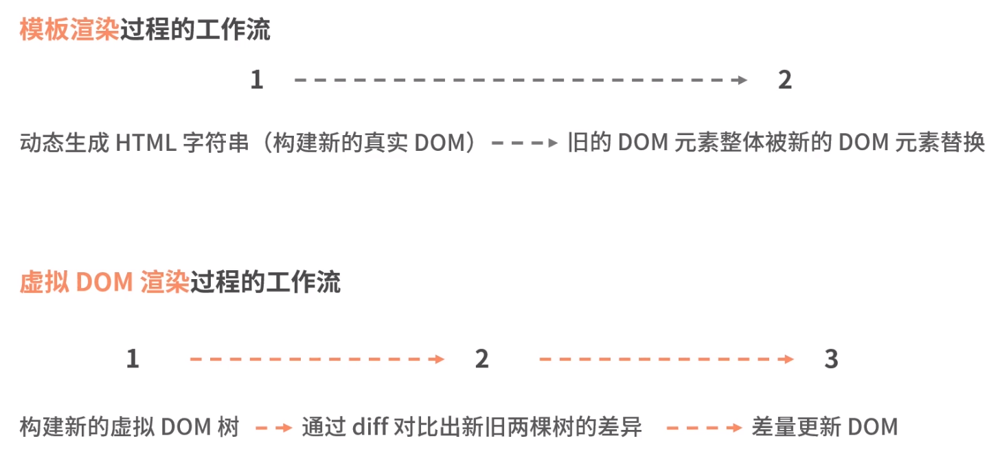
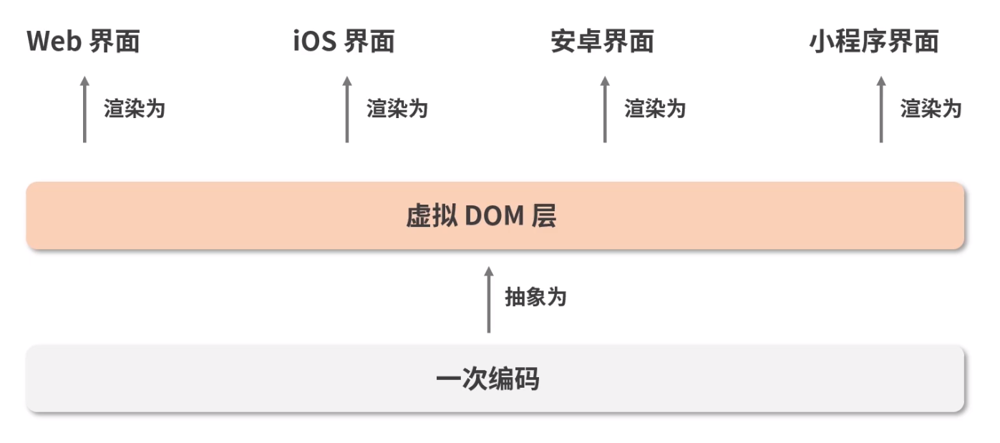

## 虚拟 DOM
> 虚拟 DOM 本质上是 js 和 DOM 之间的一个映射缓存
> 可以理解为一个描述 DOM 结构及其属性信息的 js 对象

挂载阶段：
- React 将结合 JSX 的描述，构建出虚拟 DOM 树，然后通过 ReactDOM.render 实现虚拟 DOM 到真实 DOM 的映射（进入渲染阶段）

更新阶段：
- 页面的变化将会先作用于虚拟 DOM，虚拟 DOM 将在 JS 层借助算法对比出具体有哪些真实的 DOM 节点需要改变，然后将这些改变作用于真实 DOM

### 发展过程
```
--> 大量静态 DOM，少量原生 js 
--> Jquery 时期，封装 DOM API，链式调用，插件扩展，浏览器兼容性；相对更加简单优雅
    --> DOM 操作量过大，手动操作依然很多
    --> 配合模板引擎方案（jsp, ejs...），解析 HTML 模板，拼接字符串，动态生成 js，innerHTML
    --> 旧的 DOM 销毁，整体重渲染
--> 数据驱动视图
```

### 模板引擎 VS 虚拟 DOM
```
数据
 +    ---->  真实 DOM ---> 挂载界面
模板
-------------------------------------
数据
 +    ---->  虚拟 DOM ---> 真实 DOM ---> 挂载界面
"模板" 
(如 jsx 但其本质不是模板，而是语法糖，react 并不依赖与 jsx)


新旧 虚拟 DOM 树对比 --- diff ---> 补丁集(需要更新的内容) --- patch ---> 真实 DOM
```

## 虚拟 DOM 并不是为了提高性能而生
> 虚拟 DOM 初期主要是为了提升研发效率，研发体验而生的
> 虚拟 DOM `不一定能够带来跟高的性能`，而是在提供更高效的研发模式下，还能保持不错的性能



如上图所示：
1. 字符串拼接，对性能消耗有限；虚拟 DOM 的构建以及 diff 对比，则涉及递归、遍历等，性能消耗大
2. 极端情况中，数据变化非常大，使得差量更新结果和全量更新接近甚至一致，此时 虚拟 DOM 的 js 操作反而耗时更多
3. 但在通常情况下的少量数据修改，虚拟 DOM 有绝对的优势

## 虚拟 DOM 的价值
虚拟 DOM 解决的关键问题：
1. 研发体验和效率
2. 跨平台问题，一次编码，多端运行（如图）
3. 批量更新   
    场景：差量更新速度非常快的情况下，用户只能看到最后一次更新的结果，但是前面几次更新同样会触发重渲染，带来大量消耗，并且意义不大    
    批量更新中的 batch 函数缓冲了每次更新生成的补丁集，多个补丁集暂存到队列中，集中批量更新     
    如图 Vue 当中的异步更新机制，nextTick
