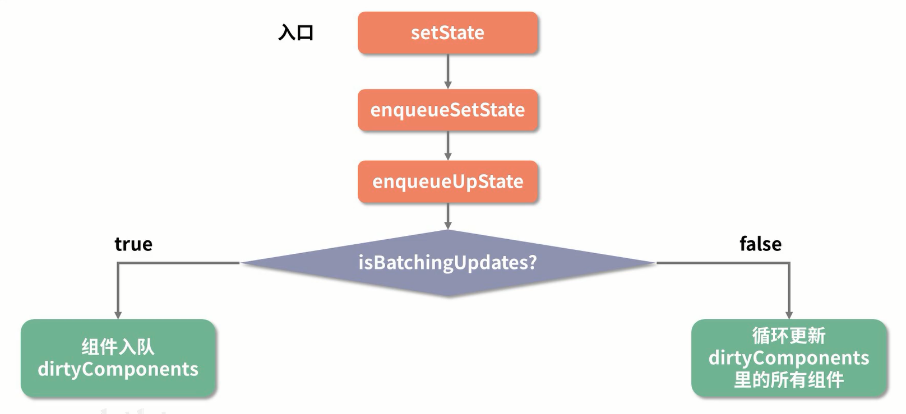

## setState
```js
export default class App extends React.Component {
  state = {
    count: 0
  }

  increment = () => {
    console.log('increment setState 前的 count = ', this.state.count);      // 0
    this.setState({
      count: this.state.count + 1
    })
    console.log('increment setState 后的 count = ', this.state.count);      // 0
  }

  triple = () => {
    console.log('triple setState 前的 count = ', this.state.count);      // 1
    this.setState({
      count: this.state.count + 1
    })
    this.setState({
      count: this.state.count + 1
    })
    this.setState({
      count: this.state.count + 1
    })
    console.log('triple setState 后的 count = ', this.state.count);      // 1
  }

  reduce = () => {
    setTimeout(() => {
      console.log('reduce setState 前的 count = ', this.state.count);      // 2
      this.setState({
        count: this.state.count - 1
      })
      console.log('reduce setState 后的 count = ', this.state.count);      // 2     React15 结果为 1 ??
    }, 0)
  }

  render () {
    return (
      <div>
        <h1>依次点击</h1>
        <button onClick={ this.increment }>增加 1</button>
        <button onClick={ this.triple }>增加 3</button>
        <button onClick={ this.reduce }>减 1</button>
        <p>{ this.state.count }</p>
      </div>
    )
  }
}
```

- increment 方法：**setState 是异步的方法，执行完 setState 不会立即改变**
- triple 方法：**批量更新**，把一个时间段内的状态修改收集起来，并进行合并，最后对最新的 state 值进行更新渲染
    ```js
    this.setState({
      count: this.state.count + 1  ===> 入队，[count + 1]
    })
    this.setState({
      count: this.state.count + 1  ===> 入队，[count + 1, count + 1]
    })
    this.setState({
      count: this.state.count + 1  ===> 入队，[count + 1, count + 1, count + 1]
    })
                                        合并 state，[count + 1]
                                        执行 count + 1
                                                            
    ```

### React15 setState 工作流
- React 管控下的 setState 都是**异步**的，如 `钩子函数、合成事件`
- `setTimeout | setInterval | DOM 操作`等 表现为 **"同步"**
- React16 中 Fiber 表现会有不同



```js
ReactComponent.prototype.setState = function (partialState, callback) {
  this.updater.enqueueSetState(this, partialState)
  if (callback) {
    this.udpater.enqueueCallback(this, callback, 'setState')
  }
}

enqueueSetState = function (publicInstance, partialState) {
  // 根据 this 拿到对应的组件实例
  var internalInstance = getInternalInstanceReadyForUpdate(publicInstance, 'setState')
  // queue 对应的是一个组件实例的 state 数组
  var queue = internalInstance._pendingStateQueue || (internalInstance._pendingStateQueue = [])
  queue.push(partialState)
  // enqueueUpdate 处理当前的组件实例
  enqueueUpdate(internalInstance)
}

function enqueueUpdate (component) {
  ensureInjected()

  // batchingStrategy 标识当前是否处于 批量创建/更新组件的阶段
  if (!batchingStrategy.isBatchingUpdates) {
    // 没有 批量创建/更新组件的阶段 则 立即更新组件
    batchingStrategy.batchingUpdates(enqueueUpdate, component)
    return
  }

  // 否则先把组件塞入 dirtyComponents 队列中，等待
  dirtyComponents.push(component)

  if (component._udpateBatchNumber == null) {
    component._udpateBatchNumber = udpateBatchNumber + 1
  }
}
```
```js
// batchingStrategy 正是用于 管控 批量更新
var ReactDefaultBatchingStrategy = {
  // 全局唯一 锁 标识
  isBatchingUpdates: false,
  // 发起更新的 方法
  batchedUpdates: function (callback, a, b, c, d, e) {
    // 缓存 锁 变量
    var alreadyBatchingStrategy = ReactDefaultBatchingStrategy.isBatchingUpdates
    // 置为 true 上锁
    ReactDefaultBatchingStrategy.isBatchingUpdates = true
  }

  if (alreadyBatchingStrategy) {
    callback(a, b, c, d, e)
  } else {
    // 启动事务 transaction，将 callback 放入事务里 执行
    transaction.perform(callback, null, a, b, c, d, e)
  }
}
```

> transaction 在 React 当中是一个**核心类**，像是一个 `被 wrapper 包裹目标函数（wrapper 可以多个，多层包裹）`，需要 transaction 暴露的 `perform` 方法去`执行这个函数`，并提供一些方法（`initialize | close ...`）

`ReactDefaultBatchingStrategy` 是一个批量更新事务 transaction，包括两个 `wrapper`：RESET_BATCHED_UPDATES、FLUSH_BATCHED_UPDATES
```JS
var RESET_BATCHED_UPDATES = {
  initialize: emptyFunction,
  close: function () {
    ReactDefaultBatchingStrategy.isBatchingUpdates = false
  }
}
var FLUSH_BATCHED_UPDATES = {
  initialize: emptyFunction,
  close: ReactUpdates.flushBatchedUpdates.bind(ReactUpdates)
}
```

`isBatchingUpdates` 在 React 生命周期 以及 合成函数*执行前*置为 true，setState 才不会立即生效；   
函数执行完毕后，事务（transaction）的 `close` 方法会把 `isBatchingUpdates` 改为 false；     
如：
```js
increment = () => {
  // 函数开始前
  isBatchingUpdates = true
  console.log('increment setState 前的 count = ', this.state.count);
  this.setState({
    count: this.state.count + 1
  })
  console.log('increment setState 后的 count = ', this.state.count);
  // 执行完函数
  isBatchingUpdates = false
}
```

但是 `isBatchingUpdates` 对 `setTimeout` 内部的逻辑没有约束力，因为 `isBatchingUpdates` 是同步代码中变化的，而 `setTimeout` 是异步执行的；      
所以在 React15 中的 `setTimeout` 使用 `setState` 会同步感知到
