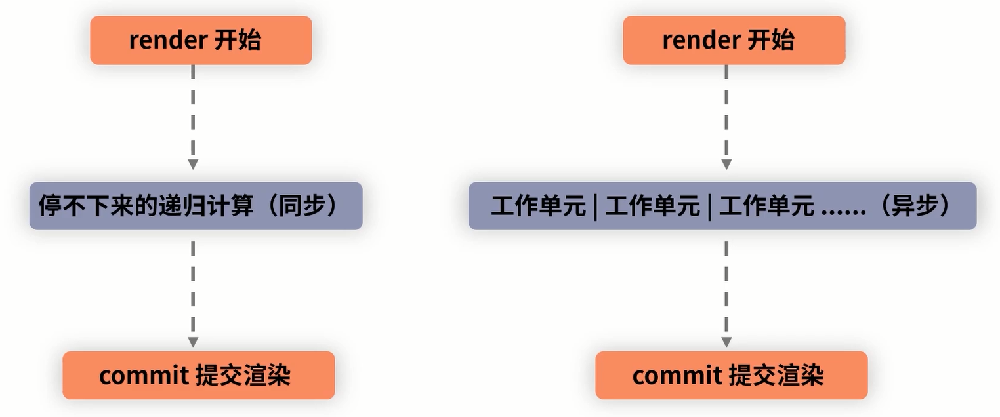

# Fiber Reconciler

## Stack Reconciler 栈调和 的问题
- 浏览器多线程，JavaScript 单线程，浏览器除了处理 JavaScript 线程意外还包括各种任务线程：处理 DOM 的 UI 渲染线程等；
- 而 JavaScript 线程是可以操作 DOM 的；
- 如果 渲染线程 和 JavaScript 线程同时工作，结果则难以预测；
- 所以 `JavaScript 线程`和 `渲染线程`必须是**互斥**的，其中一个执行时，另一个只能挂起等待
- 另外还有 `事件线程和事件循环机制 EventLoop`，
- 若 JavaScript 线程长时间占用主线程，渲染层面的更新将陷入长时间的等待，卡顿
- 并且 事件线程同样在等待，触发的事件难以响应

> Stack Reconciler 栈调和是一个`同步的递归过程`，一旦开始，必须执**行完成才能够释放主线程**，其对主线程的占用阻塞其他线程

栈调和下的 Diff 是`同层对比，深度优先遍历`，调和器会重复 "父组件调用子组件" 的过程，直到最深层的子节点跟新完毕，向上返回;

并且整个过程是`同步的，不可以被打断`

## Fiber
- Fiber 是比线程还要细的"纤程"
- Fiber 是对 React 核心算法的重写
- Fiber 是 React 内部所定义的一种数据结构
- 保存了组件需要更新的状态和副作用

Fiber 架构的目的是实现 "增量渲染"，就是把一个渲染任务分为多个渲染任务，分散到多个帧里面

Fiber = 可中断 + 可恢复 + 优先级
```
React15: Reconciler ---------> Renderer

React16: Scheduler  ---------> Reconciler ---> Renderer
        (调度更新的优先级)
```

更新工作流：
- 每个更新任务赋予一个**优先级**，任务抵达调度器时，高优先级的任务将会更快的调度进 reconsiler 层；
- 若有新的 任务B 进入调度器，则检查优先级，若新任务优先级更高，则**中断** 前任务A，将 任务B 推进 reconsiler 层；
- 任务B 完成渲染后，新一轮的调度开始，之前被中断的 任务A 将会重新推进 reconsiler 层，继续渲染；这就是 **"可恢复"**
- 注意：**被打断后，不是接着上次的 任务A 继续渲染，而是重复执行整个任务**


render 的工作单元有不同的优先级，可以根据优先级的高低去实现工作单元的 打断和恢复

工作单元的恢复重启将会对部分生命周期重复执行：
  - componentWillMount
  - componentWillUpdate
  - componentWillReceiveProps

